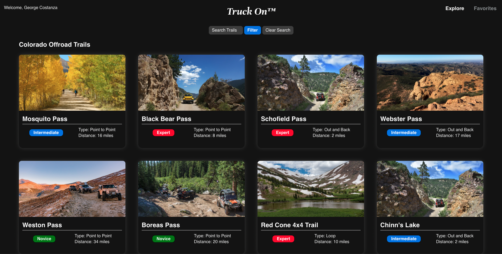
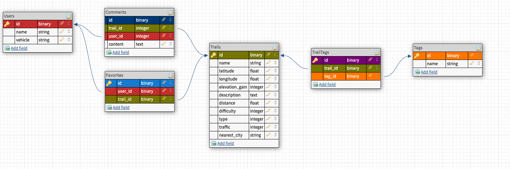

[![Contributors][contributors-shield]][contributors-url]
[![Forks][forks-shield]][forks-url]
[![Stargazers][stars-shield]][stars-url]
[![Issues][issues-shield]][issues-url]


<!-- PROJECT LOGO -->
<br />
<p align="center">

  <h3 align="center">Truck On</h3>

</p>




<!-- TABLE OF CONTENTS -->
<details open="open">
  <summary>Table of Contents</summary>
  <ol>
    <li>
      <a href="#about-the-project">About The Project</a>
      <ul>
        <li><a href="#queries">Queries</a></li>
        <li><a href="#built-with">Built With</a></li>
        <li><a href="#database-schema-design">Database Schema Design</a></li>
      </ul>
    </li>
    <li><a href="#contributing">Contributing</a></li>
    <li>
      <a href="#setup">Setup</a>
      <ul>
        <li><a href="#installation">Installation</a></li>
        <li><a href="#project-configurations">Project Configurations</
        a></li>
        <li><a href="#api-keys">API Keys</a></li>
      </ul>
    </li>
  </ol>
</details>


<!-- ABOUT THE PROJECT -->
## About The Project

Truck On allows a user to find off roading trails in Colorado. A user can save their favorite trails and add comments.

### Queries

POST /graphql

[Query Examples](https://github.com/ericli1996/truck-on-be/wiki/Queries)

### Built With

* Ruby 2.7.2
* Rails 5.2.6
* PostgreSQL
* RSpec
* SimpleCov
* Factory Bot/Faker
* GraphQL

### Database Schema Design



<!-- CONTACT -->
## Contributing


Front End:
* [David Schlundt-Bodien](https://github.com/Davidschlundtbodien)
* [Eric Li](https://github.com/ericli1996)

Back End:
* [Amanda McGuire](https://github.com/amcguire17)
* [Brian Fletcher](https://github.com/bfl3tch)

### Project Links:

[Truck On UI](https://github.com/ericli1996/truck-on-ui)

[Truck On BE](https://github.com/ericli1996/truck-on-be)

<!-- GETTING STARTED -->
## Setup

This project requires Ruby 2.7.2.

### Installation

1. Fork this repository
2. Clone the fork
3. From the command line, install gems and set up your DB:
   * `bundle install`
   * `rails db:{create,migrate,seed,csv_load:all}`
4. Run the test suite with bundle exec rspec.
5. Run your development server with rails s to see the app in action.

#### Project Configurations

* Ruby version
    ```bash
    $ ruby -v
    ruby 2.7.2p137 (2020-10-01 revision 5445e04352) [x86_64-darwin20]
    ```

* [System dependencies](https://github.com/ericli1996/truck-on-be/blob/main/Gemfile)
    ```bash
    $ rails -v
    Rails 5.2.6
    ```

* Database creation
    ```bash
    $ rails db:{drop,create,migrate}
    Created database 'truck_on_development'
    Created database 'truck_on_test'
    ```

* How to run the test suite
    ```bash
    $ bundle exec rspec -fd
    ```

* [Local Deployment](http://localhost:3000), for testing:
    ```bash
    $ rails s
    => Booting Puma
    => Rails 5.2.6 application starting in development
    => Run `rails server -h` for more startup options
    Puma starting in single mode...
    * Version 3.12.6 (ruby 2.7.2-p137), codename: Llamas in Pajamas
    * Min threads: 5, max threads: 5
    * Environment: development
    * Listening on tcp://localhost:3000
    Use Ctrl-C to stop

    ```

#### API Keys
* OpenWeather API
  1. [OpenWeather Sign Up Page](https://home.openweathermap.org/users/sign_up)
  1. Fill in information to create account
  1. Redirects to a page with to view API key
  1. Make sure Figaro has been installed
  1. Add key to config/application.yml as the value for OPENWEATHER_KEY


<!-- MARKDOWN LINKS & IMAGES -->
<!-- https://www.markdownguide.org/basic-syntax/#reference-style-links -->
[contributors-shield]: https://img.shields.io/github/contributors/ericli1996/truck-on-be.svg?style=for-the-badge
[contributors-url]: https://github.com/ericli1996/truck-on-be
[forks-shield]: https://img.shields.io/github/forks/ericli1996/truck-on-be.svg?style=for-the-badge
[forks-url]: https://github.com/ericli1996/truck-on-be/network/members
[stars-shield]: https://img.shields.io/github/stars/ericli1996/truck-on-be.svg?style=for-the-badge
[stars-url]: https://github.com/ericli1996/truck-on-be/stargazers
[issues-shield]: https://img.shields.io/github/issues/ericli1996/truck-on-be.svg?style=for-the-badge
[issues-url]: https://github.com/ericli1996/truck-on-be/issues
